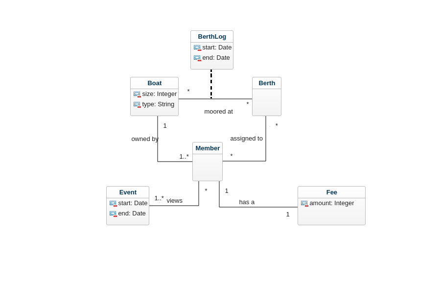

# Domain_Modell
## Grade 2
## Authors:
### Saleh Shalabi (ss225bx)

### Pic

### Berth_log
In the requirements the sysytem should know which boat hav been moored at which berth the previous years. That's why we have made a class named BerthLog, the system needs that information to assign berths and that's why we have it in our domain model.

### Boat
In our domain modell the Boat class have associations to both classes Berth and Member beacause a Boat can be moored at a Berth both Clases have multiplicity "*" because in the long run many diffrent Boats can bee moored at a Berth and a Berth can have many diffrent Boats. 
A Boat or more is owned by a Member and each Boat can be owned by one and only one Member.

### Berth
As previously mentioned a Berth has an association to Boat, and Berth have also an association to Member. This is because an Bert will be assigned to a Member. a Memeber can be assigned many Berths.  Berth have multiplicity "*" this is because it dosent say in problem description that all Berths is assigend to Members with that said it could be a possibility that a Berth can have no Boat moored at. 

### Member
This is the class with most connections to other classes in our modell. This is because the Member is the center of the club and every thing that is done should be in focus and have connection with Member. Except from associations to Boat and Berth it also have two other associations, Event and Fee. 

### Fee
Fee has an association to Memeber because when a member want to manage their Boats the Fee is updated with the new Fee Amount. 

### Event
The Event that is in th calander can be showed by Members and that's why the Event Class an Member have an association.
