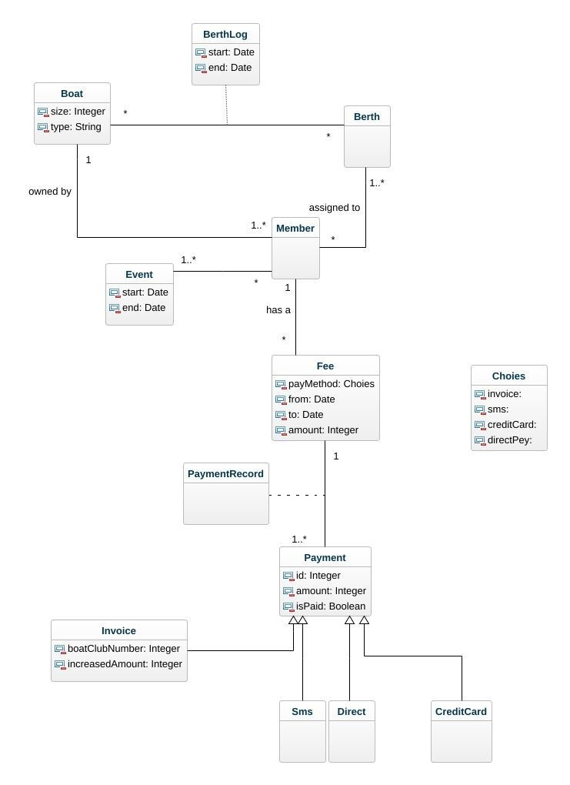

# Domain_Modell
## Grade 3
## Authors:
### Saleh Shalabi (ss225bx)

I grade 3 har vi lagt allt som är relevant med betalningar i BoatCluben 

en Member har en Fee. varje Fee kan ha en eller flera Payments. Medlemen får välja en metod att betala sina Fee med.

Alla Fee och Payments är sparade i PaymentsRecord eftersom en trasurer eller en annan part som Tax authority vill kunna see den vid ett tillfälle. PeymentRecord kan nås av Tresurer för att till exemple se vilka payment är betalda eller inte och skicka påminnelser efter detta. men vi tycker att trasurer behövs inte finnas i våran modell eftersom det som behövs finns i PaymentRecord och det spelar ingen roll vem Trassurera är så länge all info som behövs finns i modellen.

payMethod är det sättet member väljer att betala med, och payment är en abstract class som skapas efter det sättet member väljer att btala med. den har ett unikt id för varje betaning, en summa och en status på betald eller inte.

Sms, DirectPayment och CreditCard behandlas av en tredje part och därför det dom behövs finns i Payment, medans när det är Invoice så är det extra summa som ska läggas till och även boatClubNumret som behövs.
