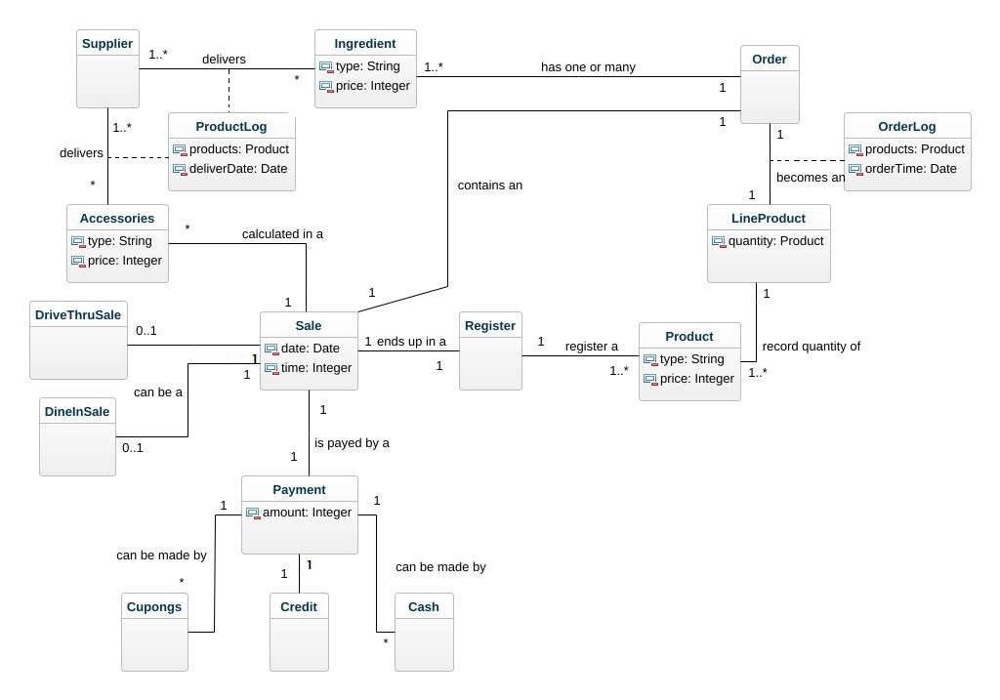

# Domain_Modell
## Grade 4
## Authors:
### Saleh Shalabi (ss225bx)

#
##

# 
I vår Grade 4 har vi valt att göra en domain model över snabbmatskedjan Mcdonalds. Den klassen i vår domain model som ligger i centrum är Sale. Detta då restaurangens grund bygger på att göra sales. Sale är kopplat till klasserna DriveThru och DineIn. Detta då en sale antingen kan ske i driven eller inne i restaurangen. Att dessa två olika sales är med då detta är till en stor vikt för restaurangen att veta för att kunna placera exempelvis rätt bemanning på rätt platser beroende på var den största försäljningen sker.  
Varje sales registreras sedan och det syns i klassen Register. Det som registreras är då produkter som en kan se i klassen Product. Varje produkt kan sedan säljas en eller flera gånger och därför behövs det en klass som LineProduct för att sammanställa alla de produkter och mängden av dessa som registreras i en Sale. Denna LineProdukten blir sedan till en Order som ska tillagas av restaurangen. 
OrderLog är en klass som registrerar de produkter som blir till en order för att kunna hålla koll på tid som ordern blev till, samt för att hålla koll på de produkter som sålts. Detta för att kunna kartlägga när sales sker för att få en överblick och se ett mönster i när kunder kommer för att kunna planera arbetsdagen. Produkterna registreras även för att kunna se hur många produkter som går åt för att kunna se vad som säljer och ha underlag för att kunna göra inventeringar. 
Varje order med produkter består av en eller flera Ingredienser. Dessa Ingredienser leveraras av företagets Suppliers som transporterar varor till restaurangen. Dessa varor kan både vara mat och tillbehöv så som kartonger till hamburgare osv. Detta syns då som ovan nämnt Ingredient, och tillbehör som Accessories. Även de leverarade varorna är viktiga att hålla koll på och därav har vi lagt till klassen ProductLog. Där registreras varorna som kommer till restaurangen. Denna är viktig för restaurangen för att kunna jämföra inköpen med försäljningen och dess produkter för att se vad som har kommit in och vad som har gått ut. Accessories är sedan kopplat till Sale. Detta då varje försäljning och sale har en summa som täcker utgifterna plus en vinst. Detta gör att kostnaderna för tillbehör i ordern är medräknat i priset.  
Sale blir sedan till en Payment. Paymenten kan betalas på flera olika sätt. Antingen med kort, som syns av klassen Credt, kuponger/presentkort som syns av klassen Cupongs och kontanter som syns av klassen Cash.
